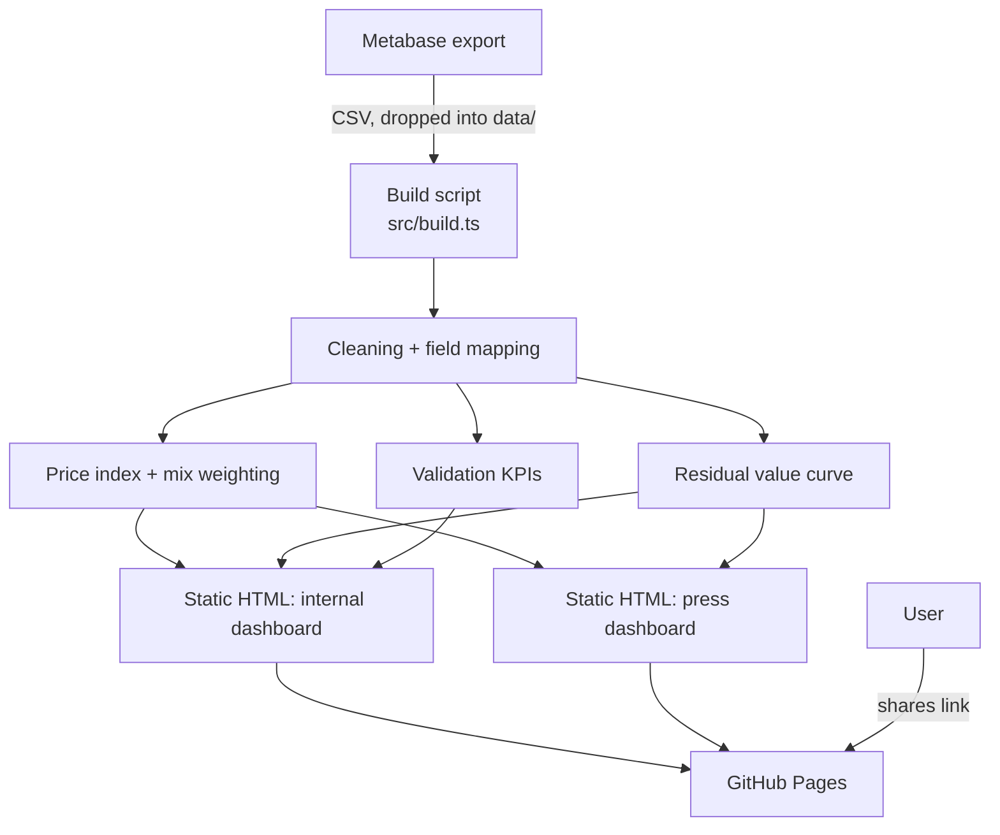

# Architecture

## Tech stack

_Check the components this project actually uses (done during project setup):_

- [x] TypeScript (strict)
- [x] Node.js LTS
- [x] npm
- [ ] SQLite (better-sqlite3) for local data — not needed; data is a CSV
      snapshot processed at build time, not queried live.
- [x] Vitest for tests
- [x] ESLint (typescript-eslint strict type-checked)
- [ ] Other: ___

## Component diagram

## Components

| Component | What it does |
|---|---|
| `data/` | Versioned Metabase CSV exports (committed — the CSV snapshot is the source of truth for reproducible builds). |
| `src/build.ts` | Entry point: reads the CSV, runs the pipeline below, writes static HTML to `outputs/`. |
| `src/load.ts` | Field mapping, brand canonicalization, cleaning/filters (methodology §2–3). |
| `src/index.ts` (pricing) | Price index + mix-adjustment weighting (methodology §4–5). |
| `src/residual.ts` | Residual-value curve fit + brand ranking (methodology §6). |
| `src/validate.ts` | Validation KPIs and the green/yellow/red readiness ampel (methodology §11). |
| `src/viz.ts` | Renders the two static HTML dashboards (internal, press) reusing the chart code from `reference/original-mockup.html`. |
| `outputs/` | Generated dashboards, committed or built in CI for GitHub Pages. |
| `.github/workflows/` | CI: on push to `main`, rebuilds and deploys `outputs/` to GitHub Pages. |
